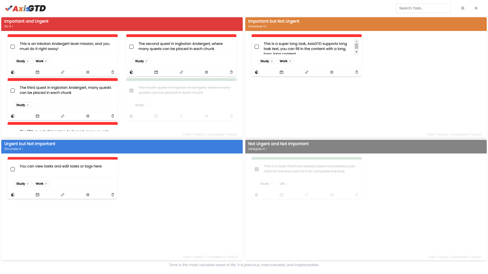

---
AxisGTD use an Axis diagram to manage your todo list, which is divided into important and urgent, important and not urgent, urgent and not important, and not urgent and not important.

This website is built using Nextjs, no login is required, and all data is saved locally in the browser.

